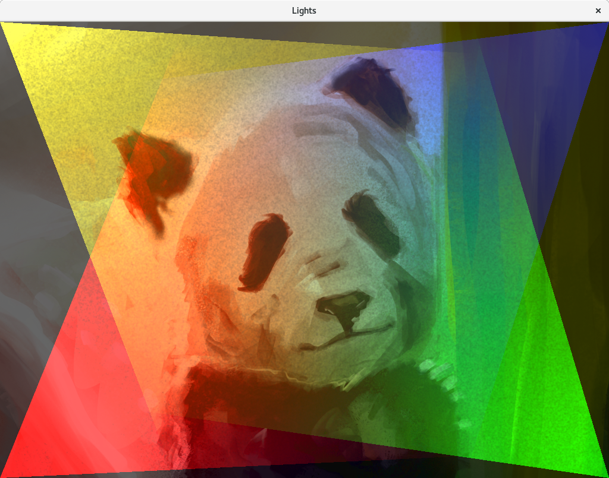
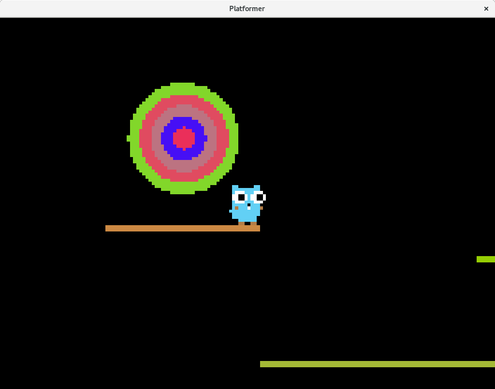
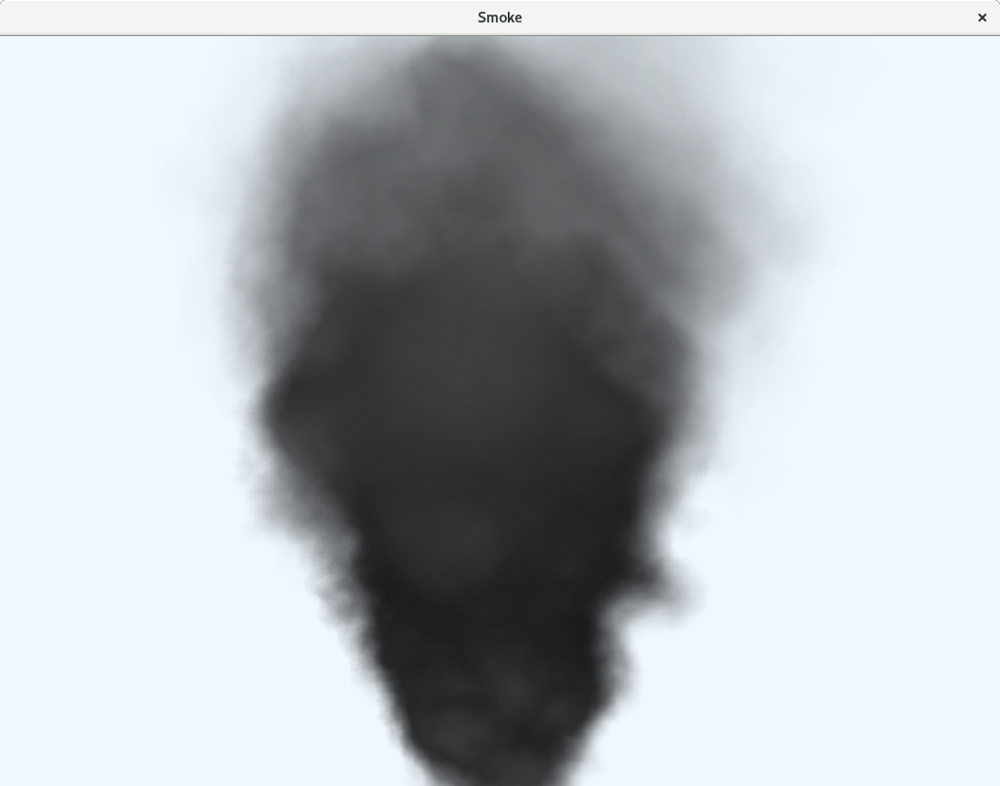

# Pixel [](https://godoc.org/github.com/faiface/pixel) [](https://goreportcard.com/report/github.com/faiface/pixel)

A simple, easy to use, fast, flexible, hand-crafter 2D game library in Go.

```
go get github.com/faiface/pixel
```

## Tutorial

The [Wiki of this repo](https://github.com/faiface/pixel/wiki) contains an extensive tutorial
covering several topics of Pixel. Here's the content of the tutorial parts so far:

- [Creating a Window](https://github.com/faiface/pixel/wiki/Creating-a-Window)
- [Drawing a Sprite](https://github.com/faiface/pixel/wiki/Drawing-a-Sprite)
- [Moving, scaling and rotating with Matrix](https://github.com/faiface/pixel/wiki/Moving,-scaling-and-rotating-with-Matrix)
- [Pressing keys and clicking mouse](https://github.com/faiface/pixel/wiki/Pressing-keys-and-clicking-mouse)
- [Drawing efficiently with Batch](https://github.com/faiface/pixel/wiki/Drawing-efficiently-with-Batch)
- [Drawing shapes with IMDraw](https://github.com/faiface/pixel/wiki/Drawing-shapes-with-IMDraw)

## Examples

The [examples](https://github.com/faiface/pixel/tree/master/examples) directory contains a few
examples demonstrating Pixel's functionality.

**To run an example**, navigate to it's directory, then `go run` the `main.go` file. For example:

```
$ cd examples/platformer
$ go run main.go
```

Here are some eye-catching screenshots from the examples!








## Features

Here's the list of the main features in Pixel. Although Pixel is still in heavy development, **you can
quite expect that the features and API that is inside the library now, will not be changed in major
ways.** This is not a 100% guarantee thought.

- Fast 2D graphics
  - Sprites
  - Primitive shapes with immediate mode style
    [IMDraw](https://github.com/faiface/pixel/wiki/Drawing-shapes-with-IMDraw) (circles, rectangles,
    lines, ...)
  - Optimized drawing with [Batch](https://github.com/faiface/pixel/wiki/Drawing-efficiently-with-Batch)
- Simple and convenient API
  - Drawing a sprite to a window is as simple as `sprite.Draw(window)`
  - Adding and subtracting vectors with `+` and `-` operators... how?
  - Wanna know where the center of a window is? `window.Bounds().Center()`
  - [...](https://godoc.org/github.com/faiface/pixel)
- Works on Linux, macOS and Windows
- Window creation and manipulation (resizing, fullscreen, multiple windows, ...)
- Keyboard and mouse input without events
- Well integrated with the Go standard library
  - Use `"image"` package for loading pictures
  - Use `"time"` package for measuring delta time and FPS
  - Use `"image/color"` for colors, or use Pixel's own `color.Color` format, which supports easy
    multiplication and a few mor features
  - Pixel uses `float64` throughout the library, compatible with `"math"` package
- Fully garbage collected, no `Close` or `Dispose` methods
- Full [Porter-Duff](http://ssp.impulsetrain.com/porterduff.html) composition, which enables
  - 2D lighting
  - Cutting holes into objects
  - Much more...
- Pixel let's you draw stuff and do your job, it doesn't impose any particular style or paradigm
- Off-screen drawing to Canvas or any other target (Batch, IMDraw, ...)
- Platform and backend independent core
- Core Target/Triangles/Picture pattern makes it easy to create new drawing targets that do
  arbitrarily crazy stuff (e.g. graphical effects)
- Small codebase, ~5K lines of code, together with the backend
  [glhf](https://github.com/faiface/glhf) package

## Missing features

Pixel is in development and still missing a few critical features. Here're the most critical ones.

- Audio
- Drawing text
- Antialiasing (filtering is supported, though)
- Better support for Hi-DPI displays
- More advanced graphical effects (e.g. blur)

**Implementing these features will get us to the 1.0 release.** Contribute, so that it's as soon as
possible!

## Requirements

PixelGL backend uses OpenGL to render graphics. Because of that, OpenGL development libraries are
needed for compilation. The dependencies are same as for [GLFW](https://github.com/go-gl/glfw).

- On macOS, you need Xcode or Command Line Tools for Xcode (`xcode-select --install`) for required
  headers and libraries.
- On Ubuntu/Debian-like Linux distributions, you need `libgl1-mesa-dev` and `xorg-dev` packages.
- On CentOS/Fedora-like Linux distributions, you need `libX11-devel libXcursor-devel libXrandr-devel
  libXinerama-devel mesa-libGL-devel libXi-devel` packages.
- See [here](http://www.glfw.org/docs/latest/compile.html#compile_deps) for full details.

## Contributing

TODO

## License

[MIT](LICENSE)